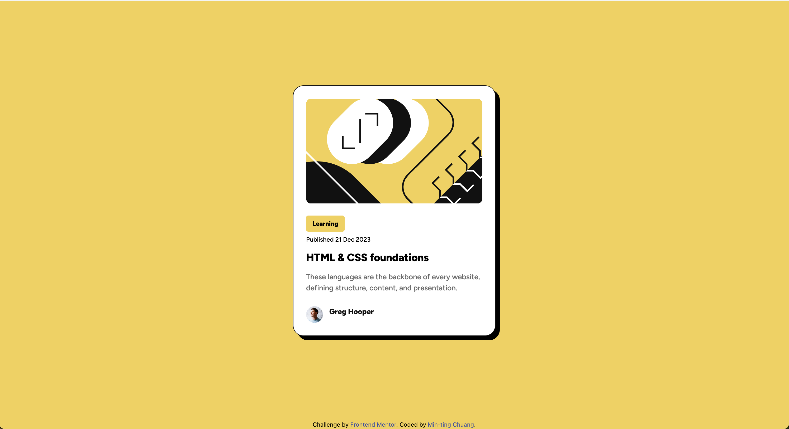
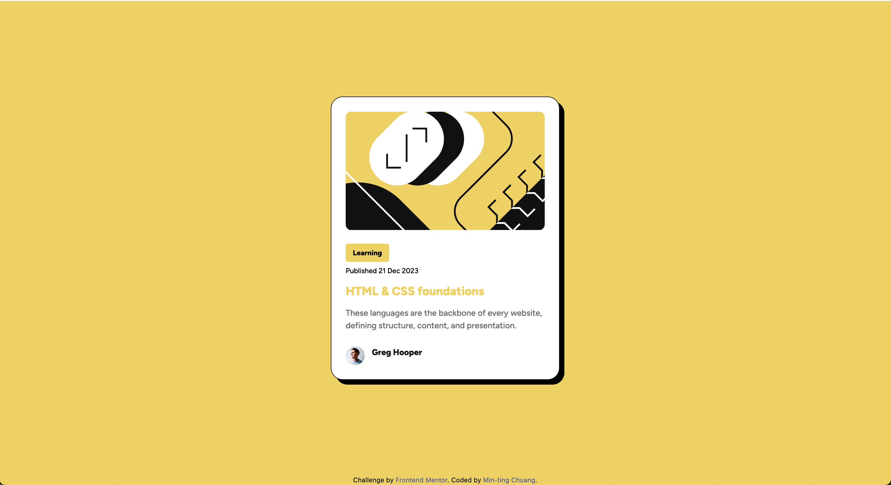
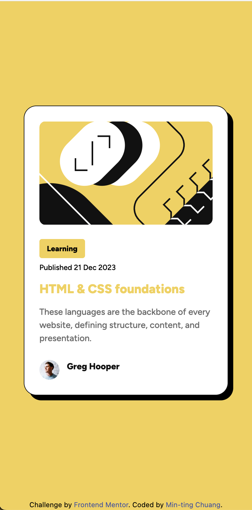

# Frontend Mentor - Blog preview card solution

This is a solution to the [Blog preview card challenge on Frontend Mentor](https://www.frontendmentor.io/challenges/blog-preview-card-ckPaj01IcS). Frontend Mentor challenges help you improve your coding skills by building realistic projects. 

## Table of contents

- [Overview](#overview)
  - [The challenge](#the-challenge)
  - [Screenshot](#screenshot)
  - [Links](#links)
- [My process](#my-process)
  - [Built with](#built-with)
- [Author](#author)

**Note: Delete this note and update the table of contents based on what sections you keep.**

## Overview

### The challenge

Users should be able to:

- See hover and focus states for all interactive elements on the page

### Screenshot

### Links

- Solution URL: (https://github.com/LisaMandarin/frontend-mentor-blog-preview-card)
- Live Site URL: (https://lisamandarin.github.io/frontend-mentor-blog-preview-card/)

## My process

### Built with

- Semantic HTML5 markup
- CSS custom properties
- Flexbox
- CSS Grid
- Mobile-first workflow
- Tailwind CSS
- [Styled Components](https://styled-components.com/) - For styles

## Author

- Website - [Min-ting Chuang](https://mtchuang.netlify.app/)
- Frontend Mentor - [@LisaMandarin](https://www.frontendmentor.io/profile/LisaMandarin)
- LinkedIn - [Min-ting Chuang](https://www.linkedin.com/in/minting0608/)
